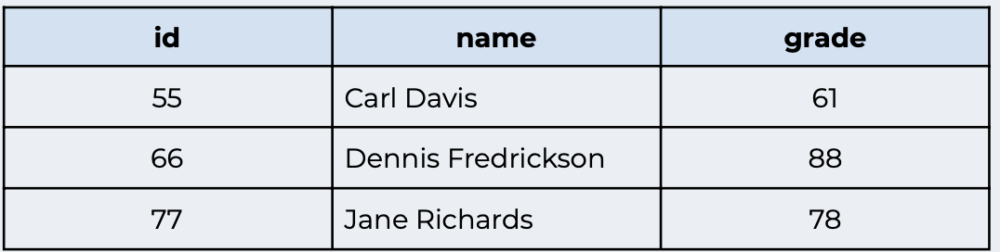

# JDBC Lab 

## Follow these steps:

* Create database `Programmers` with a table called java_programming it should have three columns `id, name, grade`. 

* Using java do the next steps: 

    * Insert the following 3 new rows into the java_programming table:

    

    * Select all records with a grade between 60 and 80.

    * Change Carl Davis’s grade to 65.

    * Delete Dennis Fredrickson’s row.

    * Change the grade of all people with an id greater than 55 to 80.

